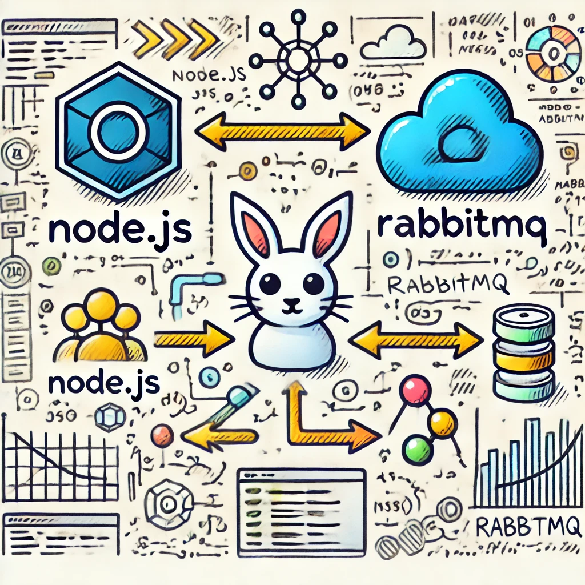
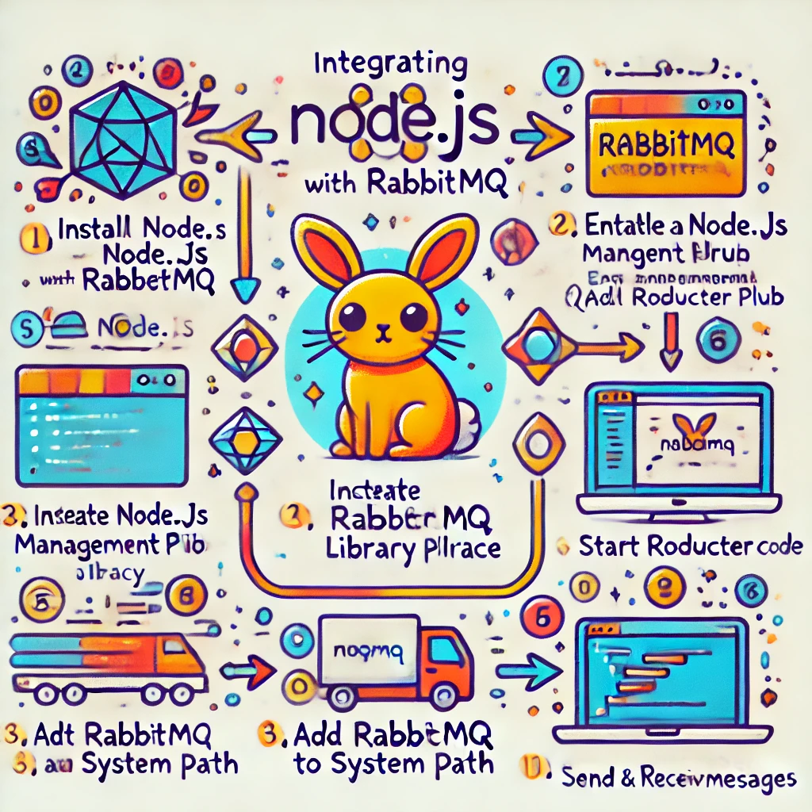

### Integração de Node.js com RabbitMQ: Um Exemplo do Mundo Real



Integrar Node.js com RabbitMQ pode trazer grandes benefícios em termos de desempenho e escalabilidade para suas
aplicações. Vamos construir um exemplo prático de como isso pode ser feito usando um aplicativo de processamento de
pedidos de comércio eletrônico.

#### Cenário do Mundo Real

Imagine um sistema de e-commerce onde os pedidos precisam ser processados de forma assíncrona. Quando um cliente faz um
pedido, ele passa por várias etapas: validação, atualização de estoque, embalagem e envio. Usar RabbitMQ permite que
essas etapas sejam gerenciadas de forma desacoplada e eficiente.

#### Ferramentas Necessárias

- **Node.js:** Plataforma para construir a aplicação.
- **RabbitMQ:** Sistema de mensageria.
- **amqplib:** Biblioteca Node.js para comunicação com RabbitMQ.

#### Passo a Passo para Integração

1. **Instalação das Dependências**

   Primeiro, vamos configurar um projeto Node.js e instalar a biblioteca `amqplib` para se comunicar com RabbitMQ.

   ```bash
   mkdir ecommerce-app
   cd ecommerce-app
   npm init -y
   npm install amqplib
   ```

2. **Configuração do RabbitMQ**

   Certifique-se de ter o RabbitMQ instalado e em execução. Para instalar o RabbitMQ no seu sistema, siga as instruções
   disponíveis no site oficial do RabbitMQ.

3. **Código para Enviar Mensagens (Produtor)**

   Crie um arquivo chamado `producer.js` para enviar mensagens ao RabbitMQ.

   ```javascript
   const amqp = require('amqplib/callback_api');

   // URL de conexão do RabbitMQ
   const RABBITMQ_URL = 'amqp://localhost';

   // Função para enviar uma mensagem
   const sendOrder = (order) => {
     amqp.connect(RABBITMQ_URL, (error0, connection) => {
       if (error0) {
         throw error0;
       }
       connection.createChannel((error1, channel) => {
         if (error1) {
           throw error1;
         }

         const queue = 'orders';
         const msg = JSON.stringify(order);

         channel.assertQueue(queue, {
           durable: true,
         });

         channel.sendToQueue(queue, Buffer.from(msg), {
           persistent: true,
         });

         console.log(" [x] Sent '%s'", msg);
       });

       setTimeout(() => {
         connection.close();
       }, 500);
     });
   };

   // Enviar um pedido de exemplo
   sendOrder({ orderId: 1, product: 'Laptop', quantity: 1 });
   ```

4. **Código para Receber Mensagens (Consumidor)**

   Crie um arquivo chamado `consumer.js` para receber e processar mensagens do RabbitMQ.

   ```javascript
   const amqp = require('amqplib/callback_api');

   // URL de conexão do RabbitMQ
   const RABBITMQ_URL = 'amqp://localhost';

   // Função para consumir mensagens
   const processOrder = () => {
     amqp.connect(RABBITMQ_URL, (error0, connection) => {
       if (error0) {
         throw error0;
       }
       connection.createChannel((error1, channel) => {
         if (error1) {
           throw error1;
         }

         const queue = 'orders';

         channel.assertQueue(queue, {
           durable: true,
         });

         channel.consume(queue, (msg) => {
           if (msg !== null) {
             const order = JSON.parse(msg.content.toString());
             console.log(" [x] Received '%s'", order);
             // Processar o pedido aqui
             console.log("Processing order: ", order);

             // Acknowledge que a mensagem foi processada
             channel.ack(msg);
           }
         }, {
           noAck: false,
         });
       });
     });
   };

   // Iniciar o consumidor
   processOrder();
   ```

5. **Executando a Aplicação**

   Primeiro, execute o consumidor para garantir que ele esteja pronto para processar mensagens:

   ```bash
   node consumer.js
   ```

   Em seguida, execute o produtor para enviar uma mensagem:

   ```bash
   node producer.js
   ```

   Você verá no console do consumidor que ele recebeu e processou o pedido.



### Conclusão

Com esses passos, você configurou um sistema básico de envio e recebimento de mensagens usando Node.js e RabbitMQ. Esse
exemplo pode ser expandido para incluir lógica de negócios mais complexa, manipulação de erros e escalabilidade.
RabbitMQ permite desacoplar os componentes do seu sistema, resultando em uma arquitetura mais robusta e fácil de manter.